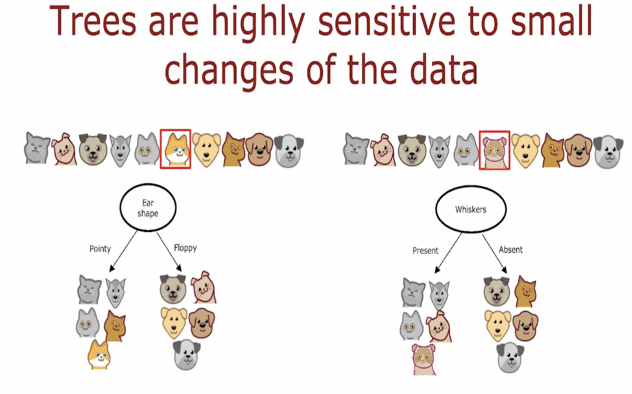
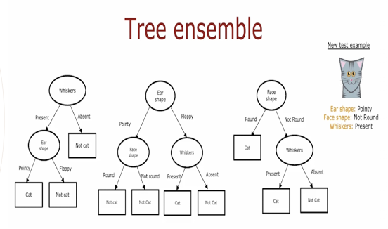
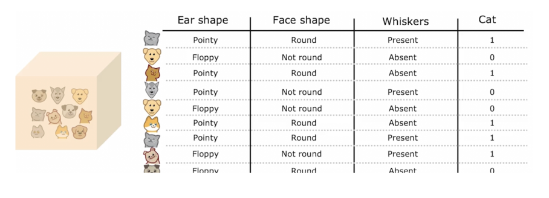
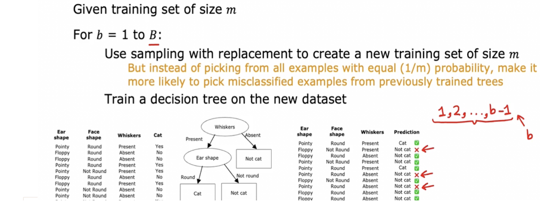
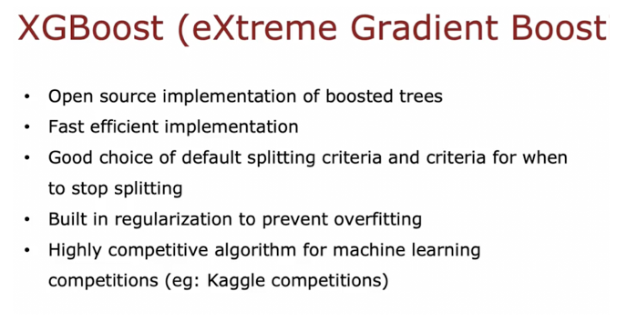

# Course 2 Week 4 
## Karar Ağaçları 
Karar ağaçları, verileri belirli bir kurala göre  dallara ayırarak sınıflandırma veya regresyon yapabilen bir makine öğrenimi modelidir. Bu model, ağaç yapısında düğümlerden ve dallardan oluşur. Bir karar ağacı, veriye ardışık bir şekilde sorular sorarak onu alt gruplara ayırır ve en uygun sonucu bulmaya çalışır.

Bu süreç, insan zihninin birtakım problemleri çözme şekline benzer. Örneğin, bir hayvanın kedi mi yoksa köpek mi olduğunu belirlemek için önce kulak şekline, sonra kuyruğun uzunluğuna bakması gibi, karar ağaçları da veride belirli özelliklere odaklanarak ilerler. 

Karar ağaçları genellikle aşağıdaki sebeplerden dolayı tercih edilir:   
**Yorumlanabilirlik**: Çıktıların açıklanması ve görselleştirilmesi kolaydır.  
**Özellik Seçimi**: Hangi özelliklerin daha önemli olduğu belirlenebilir.  
**Önişleme Gerektirmez**: Eksik veri veya normalizasyon gerektirmez.  
**Karmaşık Olmayan Yapı**: Basit kurallara göre tahmin yapar.  

Ancak karar ağaçlarının dezavantajları da vardır:  
**Aşırı Öğrenme (Overfitting)**: Derin ağaçlar, eğitildikleri veriye çok iyi uyum sağlayabilir ancak yeni verilere karşı genelleme yapmakta zorlanabilir.  
**Kararsızlık**: Küçük veri değişiklikleri, tamamen farklı ağaç yapılarının ortaya çıkmasına neden olabilir.  
  
### Karar Ağacı Yapısı 
**Kök Düğüm (Root Node)**: En üstteki düğümdür ve verinin ilk bölümlendiği noktadır. Burada verinin hangi özelliğe göre ilk bölümleneceği belirlenir. Seçilen ilk bölüm ağacın geri kalanını şekillendireceğinden büyük bir önem taşır.  
**Karar Düğümleri (Decision Nodes)**: Her düğüm, belirli bir özelliğe göre veriyi böler. Bu düğümler, veriyi farklı alt kümelere ayırarak sınıflandırma sürecini devam ettirir.  
**Yaprak Düğümler (Leaf Nodes)**: Son karar noktalarıdır ve bir sınıf veya sayısal bir değer içerir. Yaprak düğümleri, artık daha fazla bölme yapılamayan noktalardır. Buradaki değerler, modelin tahmin ettiği sonuçları temsil eder.  
  

### Karar Ağacında Bölme (Splitting)
Karar ağaçları verileri bölmek için belirli kurallar kullanır. Bir düğümün nasıl bölüneceği kritik bir karardır çünkü ağacın doğruluk oranını direkt olarak etkiler. İyi bir bölme işlemi her bir alt grubu mümkün olduğunca tek bir sınıf haline getirmeye çalışır, yani mümkün olduğunca saf bir hale getirir.

Bölme işleminin nasıl devam ettirildiğini anlatmak için önce entropi kavramını açıklayalım. Entropi, bir veri kümesindeki safsızlığı ölçen metriktir. Veri ne kadar düzensizse entropi o kadar yüksektir. Eğer bir veri kümesi %100 tek bir sınıfa aitse, bu kümenin entropi değeri 0 olur yani belirsizlik yoktur. Amacımız entropiyi düşürerek veriyi daha saf hale getirmektir.
  
Peki, bir düğümün bölünmesi sonucunda entropinin nasıl değiştiğini nasıl ölçebiliriz? İşte burada bilgi kazanımı (Information Gain) devreye girer. Bilgi kazanımı, bir düğümün bölünmesi sonucunda entropinin ne kadar azaldığını ölçer. Eğer bölme işlemi sonucu alt kümelerin entropisi önemli ölçüde azalmışsa, bu bölmenin faydalı olduğu anlamına gelir.  
  

  

### One Hot Encoding 
Karar ağaçları, sayısal özelliklerle daha iyi çalışır. Ancak, birçok veri setinde kategorik değişkenler bulunur (örneğin, "renk: kırmızı, mavi, yeşil"). Kategorik değişkenleri makine öğrenimi modellerine uygun hale getirmek için One-Hot Encoding (Tekil Kodlama) yöntemi kullanılır.

One-Hot Encoding, her kategorik değişken için ayrı bir sütun oluşturarak ve yalnızca ilgili kategoriye 1, diğerlerine 0 değerini atayarak çalışır. Örneğin kulak şekli değişkeni oval, sivri ve sarkık değerlerini gibi üç kategori içeriyorsa, one hot encoding şu şekilde olur:
  

Bu yöntem, karar ağaçları gibi algoritmaların kategorik değişkenlerle çalışmasını kolaylaştırır, çünkü model artık her özelliği bağımsız olarak değerlendirebilir.

One-Hot Encoding'in avantajları:  
Kategorik veriyi sayısal hale getirerek makine öğrenimi modellerine uygun hale getirir.  
Karar ağaçlarında özellikleri daha iyi ayırt edebilme imkanı sağlar.  
### Sürekli Değerlenen Özellikler (Continuous Features)
Karar ağaçları sadece kategorik değil, sürekli değişkenler (ağırlık, yaş) ile de çalışabilir.  
Sürekli değişkenler için bölme yapmak, belirli bir eşik değerine göre karar vermeyi gerektirir. Örneğin, "Ağırlığı 9 lbs'den büyük mü?" gibi bir soru oluşturulabilir.  
Bir veri setinde birçok sürekli değişken olabilir ve her birinin bölme noktası en iyi bilgi kazancı sağlayacak şekilde belirlenmelidir. 

  

### Regresyon Karar Ağaçları (Regression with Decision Trees)
Eğer hedef değişken sayısal bir değer içeriyorsa, karar ağaçları regresyon modeli olarak kullanılabilir. 
Yaprak düğümlerde tahmin, o düğüme gelen örneklerin ortalaması alınarak yapılır. 
Bölme kriteri olarak entropi yerine varyans, bilgi kazanımı yerine varyans azalımı (variance reduction) kullanılır. 

  

   

Tree Ensembles

Tek bir karar ağacı kullanmanın iyi olduğu kadar olumsuz yönleri de vardır. Zayıf yönlerinden biri, bu karar ağacının verilerdeki küçük değişikliklere karşı oldukça hassas olmasıdır.
Eğitim örneğini değiştirirseniz sonuçta değişir. Mesela bu kedi ilk karar ağacına göre kedi kategorisine girememişti çünkü kriterlerden biri olan keskin kulak yapısına uymuyordu ve ilk karar ağacına göre kedi değildi. Ancak eğitim örneğini değiştirip kriterimizi bıyık yaptığımızda kedi kategorisine girdi bu yüzden bahsettiğim gibi birden fazla karar ağacı yani decision tree ensembles ile hata oranını minimize etmeye çalışırız.
Tek bir eğitim örneğinin değişmesi bile o karar ağacının kökten itibaren bölünmesini değiştireceğinden o ağacı tamamen değiştirir. Böylece biz de ağaç topluluğu ile daha doğru tahminler elde ederiz.

• Burada gördüğümüz 3 decision tree de bir test verisi olan kediyi sınıflandırmanın üç farklı yolunu temsil ediyor.

• Burada en doğru tahmini minimum hatayla elde edebilmek için sınıflandırmak istediğim rastgele bir veriyi üç ağaçta da çalıştırırım ve bir sonuca varırım.
Örneğin birinci karar ağacında kriterlerim bıyığın varlığı ve kulak şekli, ikinci karar ağacında kriterleri kulak şekli yüz şekli ve bıyığın varlığı, üçüncü karar ağacında kriterin yüz şekli ve bıyığın varlığıdır. bu kriterlere göre test verisinin kategorisi tahmin edilir.
Bir ağaç topluluğu kullanmamızın nedeni çok sayıda test verisi ile minimum hata ile doğru sonuca ulaşmaktır

Peki bu ağaç topluluklarını nasıl oluştururuz?

Sampling with replacemnet

• Bir ağaç topluluğunu oluşturuken değiştirme ile örnekleme denen bir metod kullanırız.

• Burada bu gördüğmüz jetonları bir çantaya atıp her seferinde birer tane seçersek karşılaşabileceğimiz kombinasyonladan bazıları örneklendirilmilştir.

• Burada bizim veri setimizin bir kutu kedi olduğunu varsayalım. Bu tabloyu da içinden jeton seçtiğimiz bir çanta gibi düşünelim. Böylece tablomuzun her satır ve sütunu kedilerin özelliklerini temsil edecek ve sınıflandırma yaparak bir sonuca varmamızı sağlayacak.
Buradaki bu tabloyu bir kadife çantaya benzetelim ve sembolik olarak da bu kutunun içindeki kedi köpekleri yani test elimizi birer jeton olarak düşünelim. Nasıl ki bir kadife çantanın içinde bulunan jetonlardan seçtiğim her bir durum bana bir olasılık veriyorsa buradaki kedi ve köpeklere bu sütunda kategorilere ayırarak sınıflandırırım ve her bir satır bana bir olasılık sonucunu verir. Ayrıca değiştirerek rastgele bir veri seti oluşturma sürecinde oldukça benzer veri setleri de oluşturabiliriz tamamen farklı da.

Generating a tree sample

• Orijinal eğitim setine benzeyen ancak aynı zamanda oldukça farklı yeni eğitim setleri oluşturmak için değiştirme yöntemini kullanacağız.

• Buradaki ‘m’ bizim eğitim setimizin boyutunu temsil ederken ‘b’ ise bag anlamına gelen sanal çantayı temsil ediyor.

Buradaki örneğimizde birinci eğitim setimizi birinci karar ağacında işleme sokarsak ikinci veri setimizi elde ederiz ve bu da bizim sonuç tablomuz olur
Ayrıca ikinci olarak elde ettiğimiz eğitim setinde ise biraz değişiklik yaparak yeni sonuçlar elde ederiz önceki eğitim seti ile biraz benzeyebilir ancak farklıdır dolayısıyla sonuçlar ve ağaçlar da farklıdır.

Randomizing the feature choice

• Rastgele orman algoritması, torbalı karar ağaçlarının geliştirilmiş bir versiyonudur. Her düğümde rastgele bir özellik alt kümesi seçerek ağaçları daha çeşitli hale getirir. Bu yöntem, tek bir karar ağacına kıyasla daha sağlamdır ve eğitim verisindeki küçük değişikliklere karşı dayanıklıdır. Özellik seçiminde genellikle √N kuralı kullanılır. Rastgele ormanın ötesinde, artırılmış karar ağaçları gibi daha gelişmiş algoritmalar da bulunmaktadır.

Random Forest Algorithm
• Rastgele orman algoritması, torbalı karar ağaçlarının geliştirilmiş bir versiyonudur. Temel fark, her düğümde rastgele bir alt kümeden özellik seçimi yaparak ağaçları birbirinden daha farklı hale getirmesidir. Böylece, oy birliği ile daha doğru tahminler elde edilir.

• Algoritmanın çalışma mantığı şudur:

• Kök düğümde ve ona yakın düğümlerde her zaman aynı bölünmenin olmaması için, özellik seçiminde rastgelelik uygulanır.

• Bunun için, tüm özellikler arasından seçim yapmak yerine, özelliklerin bir alt kümesi (K) belirlenir ve yalnızca bu kümeden en yüksek bilgi kazancına sahip olan özellik seçilir.

Özellik sayısı (N) büyük olduğunda, genellikle K değeri √N (karekök N) olarak belirlenir. Rastgele orman, eğitim setindeki küçük değişikliklere karşı dayanıklıdır, çünkü birçok farklı karar ağacının sonuçları birleştirilerek daha güvenilir tahminler yapılır.

Boosted Trees Intuition

• Günümüzde, karar ağacı toplulukları arasında en yaygın kullanılan yöntemlerden biri XGBoost adlı algoritmadır. XGBoost, hızlı çalışması, açık kaynak olması ve ticari uygulamalarda yaygın kullanımıyla bilinir. Ayrıca, birçok makine öğrenimi yarışmasını kazanmada oldukça başarılı olmuştur.

Python’da XGBoost’u kullanmak için kütüphaneyi içe aktarabilir ve XGBClassifier sınıfını kullanarak bir model oluşturabilirsiniz. Eğer regresyon problemi çözmek isterseniz, XGBRegressor kullanabilirsiniz. Kod yapısı her iki durumda da benzerdir.

Xgboost Popüler olmasının nedeni şunlardır:

 Hız ve Verimlilik; Çünkü açık kaynaklı bir uygulama olan aşırı Gradyan arttırma yöntemiyle çalışır ve çok hızlıdır. 

Aşırı uyumu önleme; varsayılan olarak düzenlileştirme yani regularzation içerir bu da modelin aşırı öğrenmesini yani Overfittingi engeller.

Otomatik bölme kriterleri; karar ağacının ne zaman duracağını belirleyen iyi tanımlanmış bölme kriterlerine sahiptir.

Makine öğrenimi yarışmalarındaki başarıları; 
Kaggle gibi platformlarda düzenlenen yarışmalarda en başarılı algoritmalardan biridir.
XGBoost geleneksel karar ağaçlarından farklı olarak veriyi rastgele yeniden örneklemeye ihtiyaç duymaz bunun yerine farklı eğitim örneklerini ağırlıklar atayarak çalışır bu da onu daha verimli hale getirir. XGBoost kullanımı; Python‘da XGBoost kullanmak için kütüphaneyi içe aktarabilir ve XGClassifier sınıfını kullanarak bir model oluşturabilirsiniz eğer regresyon problemi çözmek isterseniz XGRegressor kullanabilirsiniz kod yapısı her iki durumda da benzerdir. Son olarak karar ağaçları ve XGBoost ne zaman tercih edilmesi gerektiğini anlamak önemlidir bazı durumlarda sinir ağları daha iyi performans gösterebilir.

Decision Trees and Neural Networks

• Yapılandırılmış verilerde, örneğin konut fiyatı tahmini gibi verilerde iyi çalışır. 

• Eğitim süreci genellikle hızlıdır, bu da hızlı iterasyon ve model geliştirme imkânı tanır.

 • Büyük ağaç toplulukları karmaşık olabilir ve yorumlanması zorlaşabilir. 

• Hesaplama kaynakları sınırlıysa, tek bir karar ağacı daha uygun olabilir, ancak genellikle ağaç toplulukları tercih edilir.

NEURAL NETWORKS

• Yapılandırılmış verilerde, örneğin konut fiyatı tahmini gibi verilerde iyi çalışır

• Birden fazla sinir ağı modelini birbirine bağlamak ve eğitmek, karar ağaçlarından daha kolaydır. 

• Eğitim süreci daha yavaş olabilir. 

• Karar ağaçlarına göre daha fazla hesaplama kaynağı gerektirir.

Kar ağaçları ve ağaç toplulukları genellikle yapılandırılmış verilerde hızlı eğitim ve yorumlana bilirlik sağlar ancak karmaşık veri setlerinde zorlaşabilir ve daha fazla kaynak gerektirir sinir ağları yapılandırılmamış verilerde görüntü ses metin gibi daha iyi çalışır ve transfer öğrenimi ile küçük veri setlerinde bile güçlü performans gösterebilir ancak eğitim süreci daha uzun ve kaynak açısından daha maliyetlidir hangi algoritmanın kullanılacağı verinin türüne ve hesaplama kaynaklarına bağlıdır. Sonuç olarak karar ağaçları genellikle yapılandırılmış veri için hızlı ve yorumlanabilir sonuçlar sağlar ancak sinir ağları daha geniş veri türleri ve transfer öğrenimi kullanarak daha esnektir ve güçlüdür hangi algoritmanın kullanılacağı verinin yapısına ve mevcut kaynaklara bağlıdır.
